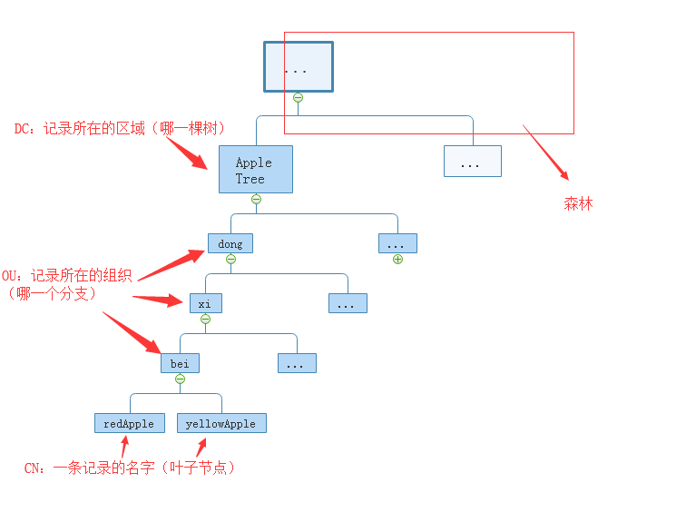
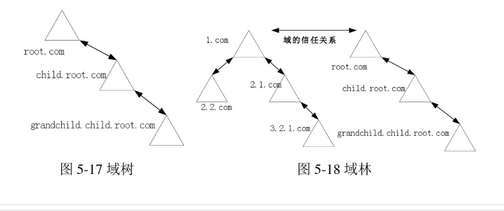
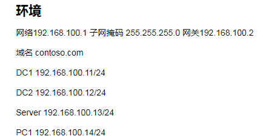
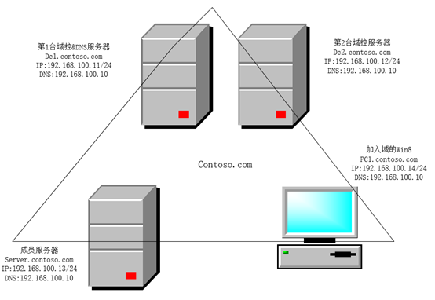
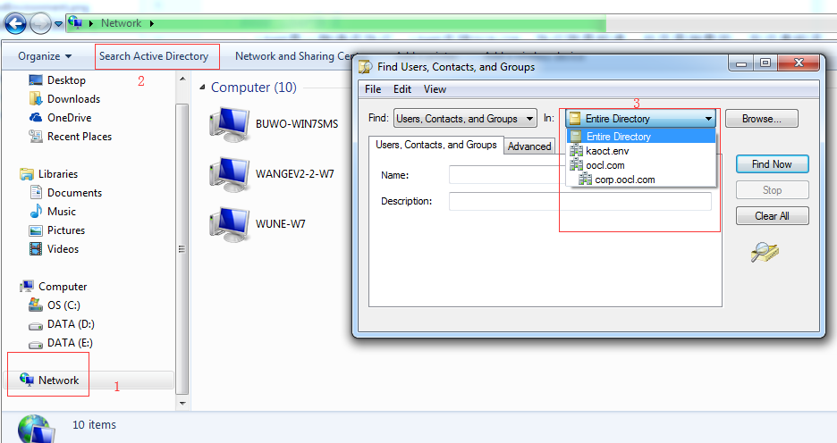
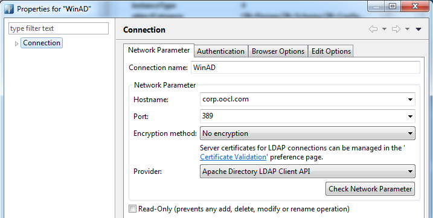
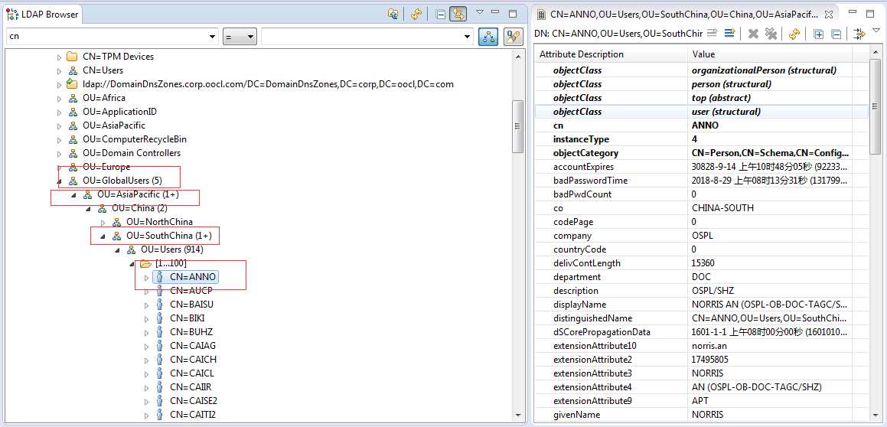

#  Active Directory Of Windows
- ### 什么是AD域
  - #### 域的含义
    > 域英文叫DOMAIN——域(Domain)是Windows网络中独立运行的单位，域之间相互访问则需要建立信任关系(即Trust Relation)。信任关系是连接在域与域之间的桥梁。当一个域与其他域建立了信任关系后，2个域之间不但可以按需要相互进行管理，还可以跨网分配文件和打印机等设备资源，使不同的域之间实现网络资源的共享与管理，以及相互通信和数据传输。
    <br>域既是 Windows 网络操作系统的逻辑组织单元，也是Internet的逻辑组织单元，在 Windows 网络操作系统中，域是安全边界。域管理员只能管理域的内部，除非其他的域显式地赋予他管理权限，他才能够访问或者管理其他的域，每个域都有自己的安全策略，以及它与其他域的安全信任关系。
    
  - #### LDAP协议
    - LDAP是一种通讯协议，LDAP支持TCP/IP。协议就是标准，并且是抽象的。在这套标准下，AD（Active Directory）是微软出的一套实现。
    
  - #### AD是LDAP的一种实现
    - #####AD理解
      - 暂且把它理解成是个数据库。也有很多人直接把LDAP说成数据库(可以把LDAP理解成存储数据的数据库)。像是其他数据库一样，LDAP也是有client端和server端。server端是用来存放资源，client端用来操作增删改查等操作。
                                                                                                                                                                                                                                                                                                                                                                           
 - ### AD数据库结构
     - 我们知道，像MySQL数据库，数据都是按记录一条条记录存在表中。而LDAP数据库，是树结构的，数据存储在叶子节点上。
     
     ```html
       树（dc=ljheee)
       分叉（ou=bei,ou=xi,ou= dong）
       苹果（cn=redApple）
       (其中dn标识一条记录，描述了一条数据的详细路径。)
     ```
           
       
     ```html
        redApple 的DN:dn:cn=redApple,ou=bei,ou=xi,ou=dong,dc=AppleTree
     ```  
     - 域树与域林
     
     
                                                                                                                                                                                                                                                                                                                                                                   
    - #### 为什么要用LDAP目录树来存储数据呢？
      - 这是因为用树形结构存储数据，查询效率更高（具体为什么，可以看一下关系型数据库索引的实现原理——B树/B+树）。在某些特定的场景下，使用树形数据库更理想。比如：需要储存大量的数据，而且数据不是经常更改，需要很快速的查找。
      - 把它与传统的关系型数据库相比，LDAP除了快速查找的特点，它还有很多的运用场景，比如域验证等。
      
 - ### 域和工作组有什么不同
   - 博客解释[什么是AD域？域和工作组有什么区别？](http://blog.sina.com.cn/s/blog_4a3450310100n0ij.html)
 - ### 域的一般部署及使用
   - #### 创建方法为先安装一台Windows服务器，然后将其升级为域控制器。然后创建第二台域控制器，一台成员服务器与一台加入域的Win X计算机
   
    
         
   - ####我们怎么查看自己所在的域及其相关信息   
     - 直接在网络邻居中查看，因为权限问题，不能查看到太多信息
      
     - ####下载Apache Dircetory Studio等相关ladp链接工具，使用相关域管理账户登录
      
       
 - ###域对于我们来说，有什么作用？
   - <P>微软基于AD的域模式，最大的优点是实现了集中式管理。以前在无数客户端要重复多次的设置，只要在域控制器上做一次设置就可以了。减少了管理员的工作量，减少了维护企业网络的开支，降低了总体拥有成本。方便了管理员 。</P>
   - <P>AD是一个大的安全边界，用户只要在登录时验证了身份，这个域林中所有允许访问资源都可以直接访问，不用再做身份验证，也提高的效率减少了维护成本。</P>
   - <P>对于用户好处，通过文件夹的重定向我们可以将所有用户桌面的“我的文档”重定向到文件服务器上。一来可以集中备份，不用担心客户端重装和故障造成用户数据丢失；而来不管用户在域中哪台计算机登录都可以找到自己的“我的文档”，实现文档跟随用走。</P>
   - <P>需要注意的是，域策略是大于本机策略的，如果你不想别人的账号登录到你的机器，在本机的用户组中把域用户删除就行了。                                                       </P>                                                                                                                                                     