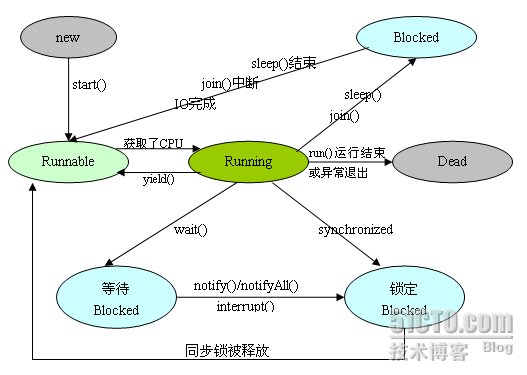

# Java中的线程-1

- 线程定义
  - 线程定义
  - 线程与进程的关系
  - 线程的状态与生命周期
   
   
- 线程的基本操作
  - 新建线程
  
  ```java
    Thread t1 = new Thread();
    t1.start;
  ```  
  > 线程Thread,有一个run()方法，start()方法就会新创建一个线程并让这个线程执行run()方法
  
  注意的是，下面的代码也能通过编译，也能正常执行，但是，却不能创建一个新的线程，而是在当前线程中调用run()方法，只是作为一个普通的方法调用。
  
  ```java
   Thread t1 = new Thread();
   t1.run();
  ```
  > 不要使用run()来开启新线程，它只会在当前线程中，串行执行run()中的代码
  
  默认情况下，Thread的run()方法什么也没做，因此，这个线程一旦开始就会结束。如果你想让它做点什么，就必须重载run()方法，把你的“task”填进去。
  
  ```java
    Thread t1 = new Thread(){ //使用匿名内部类
      @Override
      public void run(){
       System.out.println("Hello, i am a new thread");
    }
  };
    t1.start();
  ```
  
  Java是单继承的，继承本身也是一种很宝贵的资源，所以我们亦可使用Runnable接口实现同样的操作。
  
  ```java
     //Runnable接口是一个单方法接口  
   public interface Runnable{
    public abstract void run();  
   }  
  ```
    Thread类也有一个非常重要的构造方法。
    ```
    public Thread(Runnable target){}
    ```
   它传入一个Runnable接口的实例，在start()方法调用时，新的线程就会执行Runnable.run()方法。实际上，默认的Thread.run()就是这么做的。
   ```public void run(){   
      if (target != null){
        target.run();
    }
   }
  ```
  
  默认的Thread.run()就是直接调用内部的Runnable的接口。因此，使用Runable接口告诉线程该做什么，更为合理。
  ```java
    public class CreateThread3 implements Runnable{
    public static void  main(String []args){
      Thread t1 = new Thread(new CreateThread3());
      t1.start();
    }
      @Override
      public void run(){
       System.out.println("I am a Thread from Runnable");   
     }
    }  
  ```
  上述代码实现了Runnable接口，并将该实例传入Thread。这样避免重载Thread.run()，单纯使用接口来定义Thread，也是常用的做法。
  
- 线程的中断

- 线程的终止

- 等待（wait）和通知（notify）
  
  为了支持多线程的之间的协作，JDK提供了两个非常重要的接口线程等待wait()方法和通知notify方法。这两个方法并不是在Thread类中的，而是输出Object类。这意味着任何对象也可以调用这两个方法。
  ```java
     public final void wait() throws InterruptedException
     public final native void notify()
  ```
  > 当一个线程对象实例上调用wait()方法后，那么当前线程就会在这个对象上等待。
  
  
 
  
  
