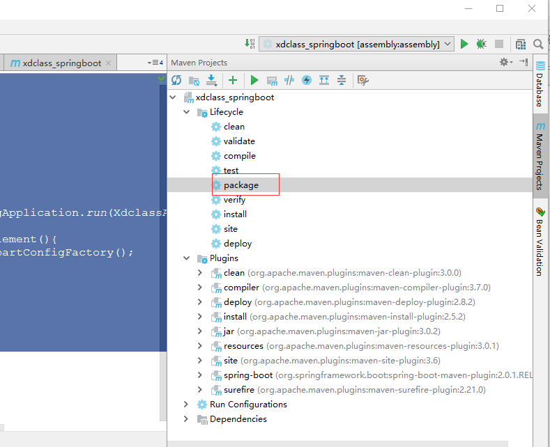
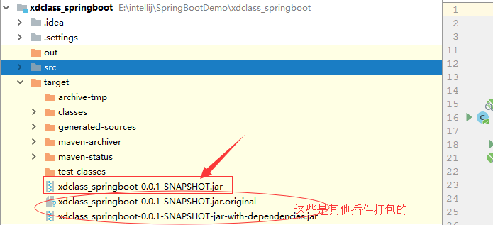

### SpringBoot打包Jar（基于IDEA+MAVEN+SpringBoot）

**IDEA中MAVEN项目打JAR包的简单方法**

- pom.xml设置
 ```xml
<project xmlns="http://maven.apache.org/POM/4.0.0" xmlns:xsi="http://www.w3.org/2001/XMLSchema-instance" xsi:schemaLocation="http://maven.apache.org/POM/4.0.0 http://maven.apache.org/xsd/maven-4.0.0.xsd">
  <modelVersion>4.0.0</modelVersion>
  <groupId>net.xdclass</groupId>
  <artifactId>xdclass_springboot</artifactId>
  <version>0.0.1-SNAPSHOT</version>
    <packaging>jar</packaging>
  
  <parent>
    <groupId>org.springframework.boot</groupId>
    <artifactId>spring-boot-starter-parent</artifactId>
    <version>2.0.1.RELEASE</version>
</parent>


<dependencies>
    <dependency>
        <groupId>org.springframework.boot</groupId>
        <artifactId>spring-boot-starter-web</artifactId>
    </dependency>
    
      <dependency>
		   <groupId>org.springframework.boot</groupId>
		   <artifactId>spring-boot-starter-thymeleaf</artifactId>
		</dependency>
</dependencies>


<build>
<plugins>
    <plugin>
        <groupId>org.springframework.boot</groupId>
        <artifactId>spring-boot-maven-plugin</artifactId>
    </plugin>
    <plugin>
        <groupId>org.apache.maven.plugins</groupId>
        <artifactId>maven-compiler-plugin</artifactId>
        <configuration>
            <source>1.8</source>
            <target>1.8</target>
        </configuration>
    </plugin>
    <plugin>
        <groupId>org.apache.maven.plugins</groupId>
        <artifactId>maven-jar-plugin</artifactId>
        <configuration>
            <archive>
                <manifest>
                    <addClasspath>true</addClasspath>
                    <useUniqueVersions>false</useUniqueVersions>
                    <classpathPrefix>lib/</classpathPrefix>
                    <mainClass>net.xdclass.demo.XdclassApplication</mainClass>
                </manifest>
                <manifestEntries>
                    <version>${project.version}</version>
                </manifestEntries>
            </archive>
        </configuration>
    </plugin>
</plugins>
</build>
  
</project>
 ```
- 入口类
```java
package net.xdclass.demo;

import org.springframework.boot.SpringApplication;
import org.springframework.boot.SpringBootConfiguration;
import org.springframework.boot.autoconfigure.EnableAutoConfiguration;
import org.springframework.boot.web.servlet.MultipartConfigFactory;
import org.springframework.context.annotation.Bean;
import org.springframework.context.annotation.ComponentScan;

import javax.servlet.MultipartConfigElement;

//@SpringBootApplication 一个注解顶下面3个
@SpringBootConfiguration
@EnableAutoConfiguration
@ComponentScan
public class XdclassApplication {

	public static void main(String[] args) {
		SpringApplication.run(XdclassApplication.class, args);
	}
	@Bean
	public MultipartConfigElement multipartConfigElement(){
		MultipartConfigFactory factory = new MultipartConfigFactory();
		//单个文件最大
		factory.setMaxFileSize("10240KB");//KB,MB
		// 设置总数据
		factory.setMaxRequestSize("1024000KB");
		return  factory.createMultipartConfig();
	}
}

```


- IDEA操作
  
  - 在Maven Project目录下，点击package
  
  
  
  - 此时在target目录下，就会生成这个项目的Jar包
  
  
  
- 遇到的问题
  - No auto configuration classes found in META-INF/spring.factories” Trying to build Spring standalone
    - 参考:[StackOverFlow](https://stackoverflow.com/questions/42058190/no-auto-configuration-classes-found-in-meta-inf-spring-factories-trying-to-bui)
  - Unable to access jar file xxx.jar
    - 参考: 运行JAR文件时需要指定路径，否则会出现如标题所示的提示。所以想要运行F:/myexamples/Hello.jar，如果当前不在F:/myexamples目录下，那么需要这样调用：java -jar F:/myexamples/Hello.jar。
  - META-INF/spring.factories中找不到自动配置类，No auto configuration classes found in META-INF/spring.factories.
    - 参考1：[亲测好像无效，来自CSDN](https://blog.csdn.net/hh652400660/article/details/79391408)  
    - 参考2：[亲测好像无效，来自CSDN](https://blog.csdn.net/starandsea/article/details/78799135)
- 其它链接  
   - 如何构建多个子目录，参考：http://www.cnblogs.com/acm-bingzi/p/6625202.html
  - 如果打成Jar包后报Unable to locate Spring NamespaceHandler for XML schema namespace错，参考：http://www.cnblogs.com/acm-bingzi/p/6625123.html
  - spring-boot-maven-plugin插件的作用，参考：http://www.cnblogs.com/acm-bingzi/p/mavenSpringBootPlugin.html