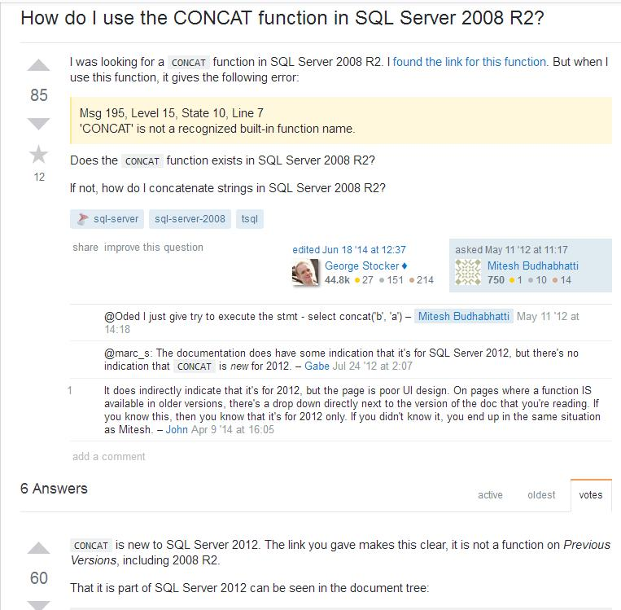

# 关于SQL函数的小总结

- #### SQL函数组成及定义
  
  函数的目标是返回一个值。大多数函数都返回一个标量值(scalar value)，标量值代表一个数据单元或一个简单值。实际上，函数可以返回任何数据类型，包括表、游标等可返回完整的多行结果集的类型。
  
- #### 函数的种类 （基于SQLSERVER与MYSQL） 

| 函数类别 | 作用|
| ------ | ------ |
| 聚合函数 | 执行的操作是将多个值合并为一个值。例如 COUNT、SUM、MIN 和 MAX。 |
| 配置函数 | 是一种标量函数，可返回有关配置设置的信息。 |
| 转换函数 | 将值从一种数据类型转换为另一种。 |
| 加密函数 | 支持加密、解密、数字签名和数字签名验证。 |
| 游标函数 |返回有关游标状态的信息。 |
| 日期和时间函数 | 可以更改日期和时间的值。 |
| 数学函数 | 执行三角、几何和其他数字运算。 |
| 元数据函数 | 返回数据库和数据库对象的属性信息。 |
| 排名函数 | 是一种非确定性函数，可以返回分区中每一行的排名值。 |
| 行集函数 | 返回可在 Transact-SQL 语句中表引用所在位置使用的行集。 |
| 安全函数 |  返回有关用户和角色的信息。|
| 字符串函数 | 可更改 char、varchar、nchar、nvarchar、binary 和 varbinary 的值。|
| 系统函数 | 对系统级的各种选项和对象进行操作或报告。 |
| 系统统计函数 | 返回有关 SQL Server 性能的信息。 |
| 文本和图像函数 | 可更改 text 和 image 的值。 |
| 自定义函数 | 返回处理过的数据 |

- #### 函数写法
  - 参数
  - 函数体
  - 变量名
  
-  #### SQL函数详述
   - 待完善

- #### 个人在开发中遇到的问题
  - SQLSERVER下，自定义函数体内不能使用print，也不能调用非系统存储过程，只能使用return返回
    - > 目前了解如下，使用函数目的是返回处理过的结果或结果集，所以不能使用print函数，也不能调用自定义的存储过程，因为自定义的存储过程除了处理数据它可能还会有其它的输出。
  - SQLSERVER2008下，不能使用CONCAT函数进行字符串的拼接
     
    -   来自StackOverFlow的解释（https://stackoverflow.com/questions/10550307/how-do-i-use-the-concat-function-in-sql-server-2008-r2）
     
    -   
    
     > 上面的意思是，2008之前的版本是不支持这个函数的。SQLSERVER 2012新增了两个字符串函数CONCAT和FORMAT。
     
   - CONCAT用法
    ```sql
    -- CONCAT 函数最多可以连接255个字符变量，当调用这个函数的时候需要至少接收两个参数
    -- 参数类型不一定是字符串类型，也可以是可以隐式转换为字符串的类型比如int ，float等类型。只要符合sql 2012的能隐式转换为字符串的规则即可，
    -- 当我们想把两个值类型的数据连接起来的时候，不需要先将它们转为nvarchar然后再通过“+”来连接了
          加前缀：update 表名 set 列名=CONCAT(‘要加内容’,列名)；
          加后缀：update 表名 set 列名=CONCAT(列名，‘要加内容’)；
          
          例子:
          UPDATE stu SET tel=CONCAT('dh',tel) ;
    ```
