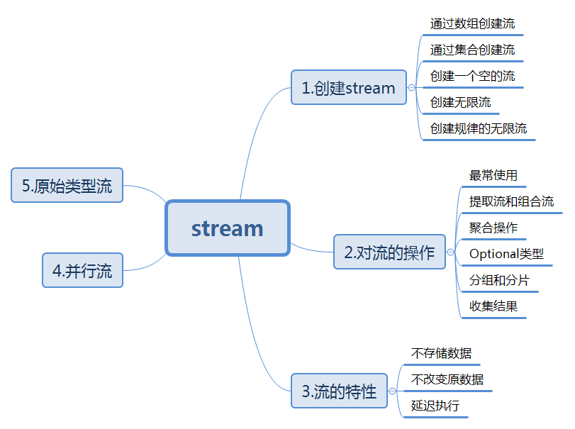
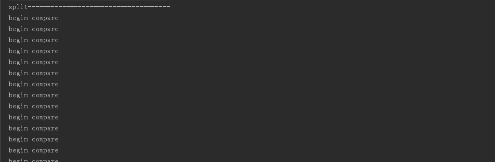

#### Lambda,Stream与及其相关使用学习
>Author: EUC GIO ZHANG

- Lambda特性
  - lambda表达式（又被成为“闭包”或“匿名方法”）
  - 方法引用和构造方法引用
  - 扩展的目标类型和类型推导
  - 接口中的默认方法和静态方法
  
- Lambda表达式是匿名方法，它提供了轻量级的语法，从而解决了匿名内部类带来的“高度问题”。
  - 一般的Lambda表达式
  
    ```java
    
         (int x, int y) -> x + y
         () -> 42
         ( String s) -> { System.out.println(s); }

    ```
      
  >第一个lambda表达式接收x和y这两个整形参数并返回它们的和；第二个lambda表达式不接收参数，返回整数'42'；第三个lambda表达式接收一个字符串并把它打印到控制台，不返回值。
   
  - Lambda表达式的语法由参数列表、箭头符号->和函数体组成。函数体既可以是一个表达式，也可以是一个语句块：
    - 表达式：表达式会被执行然后返回执行结果。
    - 语句块：语句块中的语句会被依次执行，就像方法中的语句一样
      - return语句会把控制权交给匿名方法的调用者
      - break和continue只能在循环中使用
      - 如果函数体有返回值，那么函数体内部的每一条路径都必须返回值 

   > 表达式函数体适合小型lambda表达式，它消除了return关键字，使得语法更加简洁。
   
   ```
   
      /*  下面是一些出现在语句中的lambda表达式：*/
      FileFilter java = (File f) -> f.getName().endsWith("*.java");  
      String user = doPrivileged(() -> System.getProperty("user.name"));  
      new Thread(() -> {
       connectToService();
       sendNotification();
      }).start();

   ```    
    
    更多Lambda语法介绍
    [深入理解Java 8 Lambda（语言篇——lambda，方法引用，目标类型和默认方法）](https://www.cnblogs.com/figure9/p/java-8-lambdas-insideout-language-features.html)
    
 - #### Lambda应用
 
   - ##### forEach(forEach 是为 Lambda 而设计的，保持了最紧凑的风格) 
 
   ```
             /* Map*/
          Map<String, Integer> items = new HashMap<>();
          items.put("A", 10);
          items.put("B", 20);
          items.put("C", 30);
          items.put("D", 40);
          items.put("E", 50);
          items.put("F", 60);
          
          items.forEach((k,v)->System.out.println("Item : " + k + " Count : " + v));
          
          items.forEach((k,v)->{
              System.out.println("Item : " + k + " Count : " + v);
              if("E".equals(k)){
                  System.out.println("Hello E");
              }
          });
          
          /* List*/
          List<String> items = new ArrayList<>();
          items.add("A");
          items.add("B");
          items.add("C");
          items.add("D");
          items.add("E");
          
          //lambda
          //Output : A,B,C,D,E
          items.forEach(item->System.out.println(item));
          
          //Output : C
          items.forEach(item->{
              if("C".equals(item)){
                  System.out.println(item);
              }
          });
          
          //method reference
          //Output : A,B,C,D,E
          items.forEach(System.out::println);
          
          //Stream and filter
          //Output : B
          items.stream()
              .filter(s->s.contains("B"))
              .forEach(System.out::println);
   ```
  >另外一点需要注意，forEach 是 terminal 操作，因此它执行后，Stream 的元素就被“消费”掉了，你无法对一个 Stream 进行两次 terminal 运算。下面的代码是错误的：

  ```
      stream.forEach(element -> doOneThing(element));
      stream.forEach(element -> doAnotherThing(element));
  ```

  >相反，具有相似功能的 intermediate 操作 peek 可以达到上述目的。如下是出现在该 api javadoc 上的一个示例。
 清单 peek 对每个元素执行操作并返回一个新的 Stream
 
  ```
     stream.of("one", "two", "three", "four")

    .filter(e -> e.length() > 3)

    .peek(e -> System.out.println("Filtered value: " + e))

    .map(String::toUpperCase)

    .peek(e -> System.out.println("Mapped value: " + e))

    .collect(Collectors.toList());
    
  ```
  
  - #### stream(内容摘自([java8之stream](https://www.cnblogs.com/andywithu/p/7404101.html)))
      
    - #### stream总纲
      
        
        
      - #### stream特性
      
        - stream不存储数据
        - stream不改变数据源
        - stream的延迟执行特性
      
        > 通常我们在数组或集合的基础上创建stream，stream不会专门存储数据，对stream的操作也不会影响到创建它的数组和集合,对于stream的聚合、消费或收集操作只能进行一次，再次操作会报错，如下代码：
        
        ```
          @Test
            public void test1(){
            Stream<String> stream = Stream.generate(()->"user").limit(20);
            stream.forEach(System.out::println);
            stream.forEach(System.out::println);
            }
         ``` 
         
         >程序在正常完成一次打印工作后报错。
          stream的操作是延迟执行的，在列出班上超过85分的学生姓名例子中，在collect方法执行之前，filter、sorted、map方法还未执行，只有当collect方法执行时才会触发之前转换操作
          看如下代码：
         
         ```
               public boolean filter(Student s) {
                   System.out.println("begin compare");
                   return s.getScore() > 85;
               }
                
               @Test
               public void test() {
                   Stream<Student> stream = Stream.of(stuArr).filter(this::filter);
                   System.out.println("split-------------------------------------");
                   List<Student> studentList = stream.collect(toList());
               }
         ``` 
         
         
         >当我们操作一个流的时候，并不会修改流底层的集合（即使集合是线程安全的），如果想要修改原有的集合，就无法定义流操作的输出。
          由于stream的延迟执行特性，在聚合操作执行前修改数据源是允许的。
          
         ```
              List<String> wordList;
               
              @Before
              public void init() {
                  wordList = new ArrayList<String>() {
                      {
                          add("a");
                          add("b");
                          add("c");
                          add("d");
                          add("e");
                          add("f");
                          add("g");
                      }
                  };
              }
              /**
               * 延迟执行特性，在聚合操作之前都可以添加相应元素
               */
              @Test
              public void test() {
                  Stream<String> words = wordList.stream();
                  wordList.add("END");
                  long n = words.distinct().count();
                  System.out.println(n);
              }
              
         ``` 
     
  
