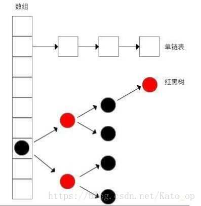

# HashMap

## HashMap简介

- HashMap 是一个散列表，它存储的内容是键值对(key-value)映射。
- HashMap 继承于AbstractMap，实现了Map、Cloneable、java.io.Serializable接口。
- HashMap 的实现不是同步的，这意味着它不是线程安全的。它的key、value都可以为null。
- HashMap 中的映射不是有序的。

 >HashMap的实例有两个参数影响其性能：“初始容量” 和 “加载因子”。容量是哈希表中桶的数量，初始容量 
只是哈希表在创建时的容量。加载因子 是哈希表在其容量自动增加之前可以达到多满的一种尺度。
当哈希表中的条目数超出了加载因子与当前容量的乘积时，则要对该哈希表进行 rehash 操作（即重建内部数据结构），
从而哈希表将具有大约两倍的桶数。通常，默认加载因子是 0.75, 这是在时间和空间成本上寻求一种折衷。
加载因子过高虽然减少了空间开销，但同时也增加了查询成本（在大多数 HashMap 类的操作中，包括 get 和 put 操作，都反映了这一点）。
在设置初始容量时应该考虑到映射中所需的条目数及其加载因子，以便最大限度地减少 rehash 操作次数。
如果初始容量大于最大条目数除以加载因子，则不会发生 rehash 操作。

- 在JDK1.8之前,HashMap底层是基于哈希表的,数据结构是数组+链表 
- 在JDK1.8,引入了红黑树,数据结构是数组+链表+红黑树
 
  
  - 引入原因：
    - 解决解决发生哈希碰撞后,链表过长从而导致索引效率慢的问题
    - 具体：
      - 利用红黑树快速增删改查的特点
      - 时间复杂度从O(n) 降为 O(logn)
   
   
  - 应用场景
    - 当链表长度>8时,将该链表转换成红黑树
    - 即红黑树作为存储数据&解决Hash冲突的第3方案 
   
      - 无冲突时:存放数组
      - 冲突&链表长度<8时:存放在单链表
      - 冲突&链表长度>8时:存放在红黑树
## HashMap构造函数
- HashMap共有4个构造函数
~~~
// 默认构造函数。
HashMap()

// 指定“容量大小”的构造函数
HashMap(int capacity)

// 指定“容量大小”和“加载因子”的构造函数
HashMap(int capacity, float loadFactor)

// 包含“子Map”的构造函数
HashMap(Map<? extends K, ? extends V> map)
~~~

- HashMap的API
~~~
void                 clear()
Object               clone()
boolean              containsKey(Object key)
boolean              containsValue(Object value)
Set<Entry<K, V>>     entrySet()
V                    get(Object key)
boolean              isEmpty()
Set<K>               keySet()
V                    put(K key, V value)
void                 putAll(Map<? extends K, ? extends V> map)
V                    remove(Object key)
int                  size()
Collection<V>        values()
~~~
