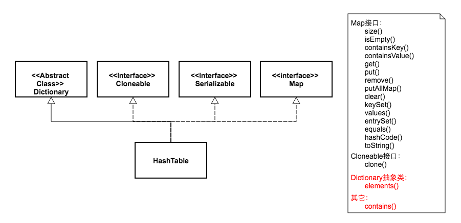
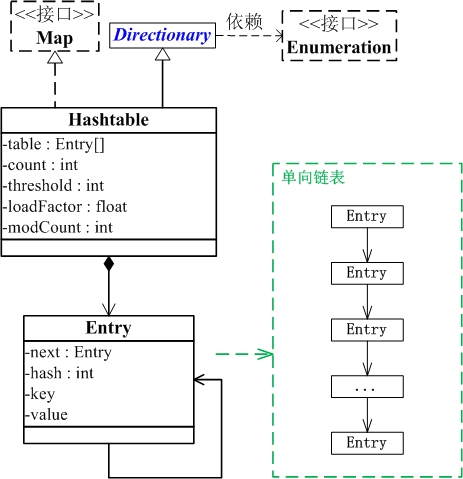

#  HashTable

## HashTable简介

- Hashtable 也是一个散列表，它存储的内容是键值对(key-value)映射。 
- Hashtable 继承于Dictionary，实现了Map、Cloneable、java.io.Serializable接口
- Hashtable 的函数都是同步的，这意味着它是线程安全的。它的key、value都不可以为null。此外，Hashtable中的映射不是有序的。
>Hashtable 的实例有两个参数影响其性能：初始容量 和 加载因子。容量 是哈希表中桶 的数量，初始容量 就是哈希表创建时的容量。注意，哈希表的状态为 open：在发生“哈希冲突”的情况下，单个桶会存储多个条目，这些条目必须按顺序搜索。加载因子 是对哈希表在其容量自动增加之前可以达到多满的一个尺度。初始容量和加载因子这两个参数只是对该实现的提示。关于何时以及是否调用 rehash 方法的具体细节则依赖于该实现。
 通常，默认加载因子是 0.75, 这是在时间和空间成本上寻求一种折衷。加载因子过高虽然减少了空间开销，但同时也增加了查找某个条目的时间（在大多数 Hashtable 操作中，包括 get 和 put 操作，都反映了这一点）。
 
 
## HashTable的构造函数

```
// 默认构造函数。
public Hashtable() 

// 指定“容量大小”的构造函数
public Hashtable(int initialCapacity) 

// 指定“容量大小”和“加载因子”的构造函数
public Hashtable(int initialCapacity, float loadFactor) 

// 包含“子Map”的构造函数
public Hashtable(Map<? extends K, ? extends V> t)
```
## HashTable的API

```
synchronized void                clear()
synchronized Object              clone()
             boolean             contains(Object value)
synchronized boolean             containsKey(Object key)
synchronized boolean             containsValue(Object value)
synchronized Enumeration<V>      elements()
synchronized Set<Entry<K, V>>    entrySet()
synchronized boolean             equals(Object object)
synchronized V                   get(Object key)
synchronized int                 hashCode()
synchronized boolean             isEmpty()
synchronized Set<K>              keySet()
synchronized Enumeration<K>      keys()
synchronized V                   put(K key, V value)
synchronized void                putAll(Map<? extends K, ? extends V> map)
synchronized V                   remove(Object key)
synchronized int                 size()
synchronized String              toString()
synchronized Collection<V>       values()

```

## HashTable数据结构

```
java.lang.Object
   ↳     java.util.Dictionary<K, V>
         ↳     java.util.Hashtable<K, V>

public class Hashtable<K,V> extends Dictionary<K,V>
    implements Map<K,V>, Cloneable, java.io.Serializable { }
```



[图片出处](http://www.cnblogs.com/skywang12345/p/3310887.html)

## HashTable源码解释(基于JDK1.6.0_45)


``` java
package java.util;
  2 import java.io.*;
  3 
  4 public class Hashtable<K,V>
  5     extends Dictionary<K,V>
  6     implements Map<K,V>, Cloneable, java.io.Serializable {
  7 
  8     // Hashtable保存key-value的数组。
  9     // Hashtable是采用拉链法实现的，每一个Entry本质上是一个单向链表
 10     private transient Entry[] table;
 11 
 12     // Hashtable中元素的实际数量
 13     private transient int count;
 14 
 15     // 阈值，用于判断是否需要调整Hashtable的容量（threshold = 容量*加载因子）
 16     private int threshold;
 17 
 18     // 加载因子
 19     private float loadFactor;
 20 
 21     // Hashtable被改变的次数
 22     private transient int modCount = 0;
 23 
 24     // 序列版本号
 25     private static final long serialVersionUID = 1421746759512286392L;
 26 
 27     // 指定“容量大小”和“加载因子”的构造函数
 28     public Hashtable(int initialCapacity, float loadFactor) {
 29         if (initialCapacity < 0)
 30             throw new IllegalArgumentException("Illegal Capacity: "+
 31                                                initialCapacity);
 32         if (loadFactor <= 0 || Float.isNaN(loadFactor))
 33             throw new IllegalArgumentException("Illegal Load: "+loadFactor);
 34 
 35         if (initialCapacity==0)
 36             initialCapacity = 1;
 37         this.loadFactor = loadFactor;
 38         table = new Entry[initialCapacity];
 39         threshold = (int)(initialCapacity * loadFactor);
 40     }
 41 
 42     // 指定“容量大小”的构造函数
 43     public Hashtable(int initialCapacity) {
 44         this(initialCapacity, 0.75f);
 45     }
 46 
 47     // 默认构造函数。
 48     public Hashtable() {
 49         // 默认构造函数，指定的容量大小是11；加载因子是0.75
 50         this(11, 0.75f);
 51     }
 52 
 53     // 包含“子Map”的构造函数
 54     public Hashtable(Map<? extends K, ? extends V> t) {
 55         this(Math.max(2*t.size(), 11), 0.75f);
 56         // 将“子Map”的全部元素都添加到Hashtable中
 57         putAll(t);
 58     }
 59 
 60     public synchronized int size() {
 61         return count;
 62     }
 63 
 64     public synchronized boolean isEmpty() {
 65         return count == 0;
 66     }
 67 
 68     // 返回“所有key”的枚举对象
 69     public synchronized Enumeration<K> keys() {
 70         return this.<K>getEnumeration(KEYS);
 71     }
 72 
 73     // 返回“所有value”的枚举对象
 74     public synchronized Enumeration<V> elements() {
 75         return this.<V>getEnumeration(VALUES);
 76     }
 77 
 78     // 判断Hashtable是否包含“值(value)”
 79     public synchronized boolean contains(Object value) {
 80         // Hashtable中“键值对”的value不能是null，
 81         // 若是null的话，抛出异常!
 82         if (value == null) {
 83             throw new NullPointerException();
 84         }
 85 
 86         // 从后向前遍历table数组中的元素(Entry)
 87         // 对于每个Entry(单向链表)，逐个遍历，判断节点的值是否等于value
 88         Entry tab[] = table;
 89         for (int i = tab.length ; i-- > 0 ;) {
 90             for (Entry<K,V> e = tab[i] ; e != null ; e = e.next) {
 91                 if (e.value.equals(value)) {
 92                     return true;
 93                 }
 94             }
 95         }
 96         return false;
 97     }
 98 
 99     public boolean containsValue(Object value) {
100         return contains(value);
101     }
102 
103     // 判断Hashtable是否包含key
104     public synchronized boolean containsKey(Object key) {
105         Entry tab[] = table;
106         int hash = key.hashCode();
107         // 计算索引值，
108         // % tab.length 的目的是防止数据越界
109         int index = (hash & 0x7FFFFFFF) % tab.length;
110         // 找到“key对应的Entry(链表)”，然后在链表中找出“哈希值”和“键值”与key都相等的元素
111         for (Entry<K,V> e = tab[index] ; e != null ; e = e.next) {
112             if ((e.hash == hash) && e.key.equals(key)) {
113                 return true;
114             }
115         }
116         return false;
117     }
118 
119     // 返回key对应的value，没有的话返回null
120     public synchronized V get(Object key) {
121         Entry tab[] = table;
122         int hash = key.hashCode();
123         // 计算索引值，
124         int index = (hash & 0x7FFFFFFF) % tab.length;
125         // 找到“key对应的Entry(链表)”，然后在链表中找出“哈希值”和“键值”与key都相等的元素
126         for (Entry<K,V> e = tab[index] ; e != null ; e = e.next) {
127             if ((e.hash == hash) && e.key.equals(key)) {
128                 return e.value;
129             }
130         }
131         return null;
132     }
133 
134     // 调整Hashtable的长度，将长度变成原来的(2倍+1)
135     // (01) 将“旧的Entry数组”赋值给一个临时变量。
136     // (02) 创建一个“新的Entry数组”，并赋值给“旧的Entry数组”
137     // (03) 将“Hashtable”中的全部元素依次添加到“新的Entry数组”中
138     protected void rehash() {
139         int oldCapacity = table.length;
140         Entry[] oldMap = table;
141 
142         int newCapacity = oldCapacity * 2 + 1;
143         Entry[] newMap = new Entry[newCapacity];
144 
145         modCount++;
146         threshold = (int)(newCapacity * loadFactor);
147         table = newMap;
148 
149         for (int i = oldCapacity ; i-- > 0 ;) {
150             for (Entry<K,V> old = oldMap[i] ; old != null ; ) {
151                 Entry<K,V> e = old;
152                 old = old.next;
153 
154                 int index = (e.hash & 0x7FFFFFFF) % newCapacity;
155                 e.next = newMap[index];
156                 newMap[index] = e;
157             }
158         }
159     }
160 
161     // 将“key-value”添加到Hashtable中
162     public synchronized V put(K key, V value) {
163         // Hashtable中不能插入value为null的元素！！！
164         if (value == null) {
165             throw new NullPointerException();
166         }
167 
168         // 若“Hashtable中已存在键为key的键值对”，
169         // 则用“新的value”替换“旧的value”
170         Entry tab[] = table;
171         int hash = key.hashCode();
172         int index = (hash & 0x7FFFFFFF) % tab.length;
173         for (Entry<K,V> e = tab[index] ; e != null ; e = e.next) {
174             if ((e.hash == hash) && e.key.equals(key)) {
175                 V old = e.value;
176                 e.value = value;
177                 return old;
178                 }
179         }
180 
181         // 若“Hashtable中不存在键为key的键值对”，
182         // (01) 将“修改统计数”+1
183         modCount++;
184         // (02) 若“Hashtable实际容量” > “阈值”(阈值=总的容量 * 加载因子)
185         //  则调整Hashtable的大小
186         if (count >= threshold) {
187             // Rehash the table if the threshold is exceeded
188             rehash();
189 
190             tab = table;
191             index = (hash & 0x7FFFFFFF) % tab.length;
192         }
193 
194         // (03) 将“Hashtable中index”位置的Entry(链表)保存到e中
195         Entry<K,V> e = tab[index];
196         // (04) 创建“新的Entry节点”，并将“新的Entry”插入“Hashtable的index位置”，并设置e为“新的Entry”的下一个元素(即“新Entry”为链表表头)。        
197         tab[index] = new Entry<K,V>(hash, key, value, e);
198         // (05) 将“Hashtable的实际容量”+1
199         count++;
200         return null;
201     }
202 
203     // 删除Hashtable中键为key的元素
204     public synchronized V remove(Object key) {
205         Entry tab[] = table;
206         int hash = key.hashCode();
207         int index = (hash & 0x7FFFFFFF) % tab.length;
208         // 找到“key对应的Entry(链表)”
209         // 然后在链表中找出要删除的节点，并删除该节点。
210         for (Entry<K,V> e = tab[index], prev = null ; e != null ; prev = e, e = e.next) {
211             if ((e.hash == hash) && e.key.equals(key)) {
212                 modCount++;
213                 if (prev != null) {
214                     prev.next = e.next;
215                 } else {
216                     tab[index] = e.next;
217                 }
218                 count--;
219                 V oldValue = e.value;
220                 e.value = null;
221                 return oldValue;
222             }
223         }
224         return null;
225     }
226 
227     // 将“Map(t)”的中全部元素逐一添加到Hashtable中
228     public synchronized void putAll(Map<? extends K, ? extends V> t) {
229         for (Map.Entry<? extends K, ? extends V> e : t.entrySet())
230             put(e.getKey(), e.getValue());
231     }
232 
233     // 清空Hashtable
234     // 将Hashtable的table数组的值全部设为null
235     public synchronized void clear() {
236         Entry tab[] = table;
237         modCount++;
238         for (int index = tab.length; --index >= 0; )
239             tab[index] = null;
240         count = 0;
241     }
242 
243     // 克隆一个Hashtable，并以Object的形式返回。
244     public synchronized Object clone() {
245         try {
246             Hashtable<K,V> t = (Hashtable<K,V>) super.clone();
247             t.table = new Entry[table.length];
248             for (int i = table.length ; i-- > 0 ; ) {
249                 t.table[i] = (table[i] != null)
250                 ? (Entry<K,V>) table[i].clone() : null;
251             }
252             t.keySet = null;
253             t.entrySet = null;
254             t.values = null;
255             t.modCount = 0;
256             return t;
257         } catch (CloneNotSupportedException e) {
258             // this shouldn't happen, since we are Cloneable
259             throw new InternalError();
260         }
261     }
262 
263     public synchronized String toString() {
264         int max = size() - 1;
265         if (max == -1)
266             return "{}";
267 
268         StringBuilder sb = new StringBuilder();
269         Iterator<Map.Entry<K,V>> it = entrySet().iterator();
270 
271         sb.append('{');
272         for (int i = 0; ; i++) {
273             Map.Entry<K,V> e = it.next();
274             K key = e.getKey();
275             V value = e.getValue();
276             sb.append(key   == this ? "(this Map)" : key.toString());
277             sb.append('=');
278             sb.append(value == this ? "(this Map)" : value.toString());
279 
280             if (i == max)
281                 return sb.append('}').toString();
282             sb.append(", ");
283         }
284     }
285 
286     // 获取Hashtable的枚举类对象
287     // 若Hashtable的实际大小为0,则返回“空枚举类”对象；
288     // 否则，返回正常的Enumerator的对象。(Enumerator实现了迭代器和枚举两个接口)
289     private <T> Enumeration<T> getEnumeration(int type) {
290     if (count == 0) {
291         return (Enumeration<T>)emptyEnumerator;
292     } else {
293         return new Enumerator<T>(type, false);
294     }
295     }
296 
297     // 获取Hashtable的迭代器
298     // 若Hashtable的实际大小为0,则返回“空迭代器”对象；
299     // 否则，返回正常的Enumerator的对象。(Enumerator实现了迭代器和枚举两个接口)
300     private <T> Iterator<T> getIterator(int type) {
301         if (count == 0) {
302             return (Iterator<T>) emptyIterator;
303         } else {
304             return new Enumerator<T>(type, true);
305         }
306     }
307 
308     // Hashtable的“key的集合”。它是一个Set，意味着没有重复元素
309     private transient volatile Set<K> keySet = null;
310     // Hashtable的“key-value的集合”。它是一个Set，意味着没有重复元素
311     private transient volatile Set<Map.Entry<K,V>> entrySet = null;
312     // Hashtable的“key-value的集合”。它是一个Collection，意味着可以有重复元素
313     private transient volatile Collection<V> values = null;
314 
315     // 返回一个被synchronizedSet封装后的KeySet对象
316     // synchronizedSet封装的目的是对KeySet的所有方法都添加synchronized，实现多线程同步
317     public Set<K> keySet() {
318         if (keySet == null)
319             keySet = Collections.synchronizedSet(new KeySet(), this);
320         return keySet;
321     }
322 
323     // Hashtable的Key的Set集合。
324     // KeySet继承于AbstractSet，所以，KeySet中的元素没有重复的。
325     private class KeySet extends AbstractSet<K> {
326         public Iterator<K> iterator() {
327             return getIterator(KEYS);
328         }
329         public int size() {
330             return count;
331         }
332         public boolean contains(Object o) {
333             return containsKey(o);
334         }
335         public boolean remove(Object o) {
336             return Hashtable.this.remove(o) != null;
337         }
338         public void clear() {
339             Hashtable.this.clear();
340         }
341     }
342 
343     // 返回一个被synchronizedSet封装后的EntrySet对象
344     // synchronizedSet封装的目的是对EntrySet的所有方法都添加synchronized，实现多线程同步
345     public Set<Map.Entry<K,V>> entrySet() {
346         if (entrySet==null)
347             entrySet = Collections.synchronizedSet(new EntrySet(), this);
348         return entrySet;
349     }
350 
351     // Hashtable的Entry的Set集合。
352     // EntrySet继承于AbstractSet，所以，EntrySet中的元素没有重复的。
353     private class EntrySet extends AbstractSet<Map.Entry<K,V>> {
354         public Iterator<Map.Entry<K,V>> iterator() {
355             return getIterator(ENTRIES);
356         }
357 
358         public boolean add(Map.Entry<K,V> o) {
359             return super.add(o);
360         }
361 
362         // 查找EntrySet中是否包含Object(0)
363         // 首先，在table中找到o对应的Entry(Entry是一个单向链表)
364         // 然后，查找Entry链表中是否存在Object
365         public boolean contains(Object o) {
366             if (!(o instanceof Map.Entry))
367                 return false;
368             Map.Entry entry = (Map.Entry)o;
369             Object key = entry.getKey();
370             Entry[] tab = table;
371             int hash = key.hashCode();
372             int index = (hash & 0x7FFFFFFF) % tab.length;
373 
374             for (Entry e = tab[index]; e != null; e = e.next)
375                 if (e.hash==hash && e.equals(entry))
376                     return true;
377             return false;
378         }
379 
380         // 删除元素Object(0)
381         // 首先，在table中找到o对应的Entry(Entry是一个单向链表)
382         // 然后，删除链表中的元素Object
383         public boolean remove(Object o) {
384             if (!(o instanceof Map.Entry))
385                 return false;
386             Map.Entry<K,V> entry = (Map.Entry<K,V>) o;
387             K key = entry.getKey();
388             Entry[] tab = table;
389             int hash = key.hashCode();
390             int index = (hash & 0x7FFFFFFF) % tab.length;
391 
392             for (Entry<K,V> e = tab[index], prev = null; e != null;
393                  prev = e, e = e.next) {
394                 if (e.hash==hash && e.equals(entry)) {
395                     modCount++;
396                     if (prev != null)
397                         prev.next = e.next;
398                     else
399                         tab[index] = e.next;
400 
401                     count--;
402                     e.value = null;
403                     return true;
404                 }
405             }
406             return false;
407         }
408 
409         public int size() {
410             return count;
411         }
412 
413         public void clear() {
414             Hashtable.this.clear();
415         }
416     }
417 
418     // 返回一个被synchronizedCollection封装后的ValueCollection对象
419     // synchronizedCollection封装的目的是对ValueCollection的所有方法都添加synchronized，实现多线程同步
420     public Collection<V> values() {
421     if (values==null)
422         values = Collections.synchronizedCollection(new ValueCollection(),
423                                                         this);
424         return values;
425     }
426 
427     // Hashtable的value的Collection集合。
428     // ValueCollection继承于AbstractCollection，所以，ValueCollection中的元素可以重复的。
429     private class ValueCollection extends AbstractCollection<V> {
430         public Iterator<V> iterator() {
431         return getIterator(VALUES);
432         }
433         public int size() {
434             return count;
435         }
436         public boolean contains(Object o) {
437             return containsValue(o);
438         }
439         public void clear() {
440             Hashtable.this.clear();
441         }
442     }
443 
444     // 重新equals()函数
445     // 若两个Hashtable的所有key-value键值对都相等，则判断它们两个相等
446     public synchronized boolean equals(Object o) {
447         if (o == this)
448             return true;
449 
450         if (!(o instanceof Map))
451             return false;
452         Map<K,V> t = (Map<K,V>) o;
453         if (t.size() != size())
454             return false;
455 
456         try {
457             // 通过迭代器依次取出当前Hashtable的key-value键值对
458             // 并判断该键值对，存在于Hashtable(o)中。
459             // 若不存在，则立即返回false；否则，遍历完“当前Hashtable”并返回true。
460             Iterator<Map.Entry<K,V>> i = entrySet().iterator();
461             while (i.hasNext()) {
462                 Map.Entry<K,V> e = i.next();
463                 K key = e.getKey();
464                 V value = e.getValue();
465                 if (value == null) {
466                     if (!(t.get(key)==null && t.containsKey(key)))
467                         return false;
468                 } else {
469                     if (!value.equals(t.get(key)))
470                         return false;
471                 }
472             }
473         } catch (ClassCastException unused)   {
474             return false;
475         } catch (NullPointerException unused) {
476             return false;
477         }
478 
479         return true;
480     }
481 
482     // 计算Hashtable的哈希值
483     // 若 Hashtable的实际大小为0 或者 加载因子<0，则返回0。
484     // 否则，返回“Hashtable中的每个Entry的key和value的异或值 的总和”。
485     public synchronized int hashCode() {
486         int h = 0;
487         if (count == 0 || loadFactor < 0)
488             return h;  // Returns zero
489 
490         loadFactor = -loadFactor;  // Mark hashCode computation in progress
491         Entry[] tab = table;
492         for (int i = 0; i < tab.length; i++)
493             for (Entry e = tab[i]; e != null; e = e.next)
494                 h += e.key.hashCode() ^ e.value.hashCode();
495         loadFactor = -loadFactor;  // Mark hashCode computation complete
496 
497         return h;
498     }
499 
500     // java.io.Serializable的写入函数
501     // 将Hashtable的“总的容量，实际容量，所有的Entry”都写入到输出流中
502     private synchronized void writeObject(java.io.ObjectOutputStream s)
503         throws IOException
504     {
505         // Write out the length, threshold, loadfactor
506         s.defaultWriteObject();
507 
508         // Write out length, count of elements and then the key/value objects
509         s.writeInt(table.length);
510         s.writeInt(count);
511         for (int index = table.length-1; index >= 0; index--) {
512             Entry entry = table[index];
513 
514             while (entry != null) {
515             s.writeObject(entry.key);
516             s.writeObject(entry.value);
517             entry = entry.next;
518             }
519         }
520     }
521 
522     // java.io.Serializable的读取函数：根据写入方式读出
523     // 将Hashtable的“总的容量，实际容量，所有的Entry”依次读出
524     private void readObject(java.io.ObjectInputStream s)
525          throws IOException, ClassNotFoundException
526     {
527         // Read in the length, threshold, and loadfactor
528         s.defaultReadObject();
529 
530         // Read the original length of the array and number of elements
531         int origlength = s.readInt();
532         int elements = s.readInt();
533 
534         // Compute new size with a bit of room 5% to grow but
535         // no larger than the original size.  Make the length
536         // odd if it's large enough, this helps distribute the entries.
537         // Guard against the length ending up zero, that's not valid.
538         int length = (int)(elements * loadFactor) + (elements / 20) + 3;
539         if (length > elements && (length & 1) == 0)
540             length--;
541         if (origlength > 0 && length > origlength)
542             length = origlength;
543 
544         Entry[] table = new Entry[length];
545         count = 0;
546 
547         // Read the number of elements and then all the key/value objects
548         for (; elements > 0; elements--) {
549             K key = (K)s.readObject();
550             V value = (V)s.readObject();
551                 // synch could be eliminated for performance
552                 reconstitutionPut(table, key, value);
553         }
554         this.table = table;
555     }
556 
557     private void reconstitutionPut(Entry[] tab, K key, V value)
558         throws StreamCorruptedException
559     {
560         if (value == null) {
561             throw new java.io.StreamCorruptedException();
562         }
563         // Makes sure the key is not already in the hashtable.
564         // This should not happen in deserialized version.
565         int hash = key.hashCode();
566         int index = (hash & 0x7FFFFFFF) % tab.length;
567         for (Entry<K,V> e = tab[index] ; e != null ; e = e.next) {
568             if ((e.hash == hash) && e.key.equals(key)) {
569                 throw new java.io.StreamCorruptedException();
570             }
571         }
572         // Creates the new entry.
573         Entry<K,V> e = tab[index];
574         tab[index] = new Entry<K,V>(hash, key, value, e);
575         count++;
576     }
577 
578     // Hashtable的Entry节点，它本质上是一个单向链表。
579     // 也因此，我们才能推断出Hashtable是由拉链法实现的散列表
580     private static class Entry<K,V> implements Map.Entry<K,V> {
581         // 哈希值
582         int hash;
583         K key;
584         V value;
585         // 指向的下一个Entry，即链表的下一个节点
586         Entry<K,V> next;
587 
588         // 构造函数
589         protected Entry(int hash, K key, V value, Entry<K,V> next) {
590             this.hash = hash;
591             this.key = key;
592             this.value = value;
593             this.next = next;
594         }
595 
596         protected Object clone() {
597             return new Entry<K,V>(hash, key, value,
598                   (next==null ? null : (Entry<K,V>) next.clone()));
599         }
600 
601         public K getKey() {
602             return key;
603         }
604 
605         public V getValue() {
606             return value;
607         }
608 
609         // 设置value。若value是null，则抛出异常。
610         public V setValue(V value) {
611             if (value == null)
612                 throw new NullPointerException();
613 
614             V oldValue = this.value;
615             this.value = value;
616             return oldValue;
617         }
618 
619         // 覆盖equals()方法，判断两个Entry是否相等。
620         // 若两个Entry的key和value都相等，则认为它们相等。
621         public boolean equals(Object o) {
622             if (!(o instanceof Map.Entry))
623                 return false;
624             Map.Entry e = (Map.Entry)o;
625 
626             return (key==null ? e.getKey()==null : key.equals(e.getKey())) &&
627                (value==null ? e.getValue()==null : value.equals(e.getValue()));
628         }
629 
630         public int hashCode() {
631             return hash ^ (value==null ? 0 : value.hashCode());
632         }
633 
634         public String toString() {
635             return key.toString()+"="+value.toString();
636         }
637     }
638 
639     private static final int KEYS = 0;
640     private static final int VALUES = 1;
641     private static final int ENTRIES = 2;
642 
643     // Enumerator的作用是提供了“通过elements()遍历Hashtable的接口” 和 “通过entrySet()遍历Hashtable的接口”。因为，它同时实现了 “Enumerator接口”和“Iterator接口”。
644     private class Enumerator<T> implements Enumeration<T>, Iterator<T> {
645         // 指向Hashtable的table
646         Entry[] table = Hashtable.this.table;
647         // Hashtable的总的大小
648         int index = table.length;
649         Entry<K,V> entry = null;
650         Entry<K,V> lastReturned = null;
651         int type;
652 
653         // Enumerator是 “迭代器(Iterator)” 还是 “枚举类(Enumeration)”的标志
654         // iterator为true，表示它是迭代器；否则，是枚举类。
655         boolean iterator;
656 
657         // 在将Enumerator当作迭代器使用时会用到，用来实现fail-fast机制。
658         protected int expectedModCount = modCount;
659 
660         Enumerator(int type, boolean iterator) {
661             this.type = type;
662             this.iterator = iterator;
663         }
664 
665         // 从遍历table的数组的末尾向前查找，直到找到不为null的Entry。
666         public boolean hasMoreElements() {
667             Entry<K,V> e = entry;
668             int i = index;
669             Entry[] t = table;
670             /* Use locals for faster loop iteration */
671             while (e == null && i > 0) {
672                 e = t[--i];
673             }
674             entry = e;
675             index = i;
676             return e != null;
677         }
678 
679         // 获取下一个元素
680         // 注意：从hasMoreElements() 和nextElement() 可以看出“Hashtable的elements()遍历方式”
681         // 首先，从后向前的遍历table数组。table数组的每个节点都是一个单向链表(Entry)。
682         // 然后，依次向后遍历单向链表Entry。
683         public T nextElement() {
684             Entry<K,V> et = entry;
685             int i = index;
686             Entry[] t = table;
687             /* Use locals for faster loop iteration */
688             while (et == null && i > 0) {
689                 et = t[--i];
690             }
691             entry = et;
692             index = i;
693             if (et != null) {
694                 Entry<K,V> e = lastReturned = entry;
695                 entry = e.next;
696                 return type == KEYS ? (T)e.key : (type == VALUES ? (T)e.value : (T)e);
697             }
698             throw new NoSuchElementException("Hashtable Enumerator");
699         }
700 
701         // 迭代器Iterator的判断是否存在下一个元素
702         // 实际上，它是调用的hasMoreElements()
703         public boolean hasNext() {
704             return hasMoreElements();
705         }
706 
707         // 迭代器获取下一个元素
708         // 实际上，它是调用的nextElement()
709         public T next() {
710             if (modCount != expectedModCount)
711                 throw new ConcurrentModificationException();
712             return nextElement();
713         }
714 
715         // 迭代器的remove()接口。
716         // 首先，它在table数组中找出要删除元素所在的Entry，
717         // 然后，删除单向链表Entry中的元素。
718         public void remove() {
719             if (!iterator)
720                 throw new UnsupportedOperationException();
721             if (lastReturned == null)
722                 throw new IllegalStateException("Hashtable Enumerator");
723             if (modCount != expectedModCount)
724                 throw new ConcurrentModificationException();
725 
726             synchronized(Hashtable.this) {
727                 Entry[] tab = Hashtable.this.table;
728                 int index = (lastReturned.hash & 0x7FFFFFFF) % tab.length;
729 
730                 for (Entry<K,V> e = tab[index], prev = null; e != null;
731                      prev = e, e = e.next) {
732                     if (e == lastReturned) {
733                         modCount++;
734                         expectedModCount++;
735                         if (prev == null)
736                             tab[index] = e.next;
737                         else
738                             prev.next = e.next;
739                         count--;
740                         lastReturned = null;
741                         return;
742                     }
743                 }
744                 throw new ConcurrentModificationException();
745             }
746         }
747     }
748 
749 
750     private static Enumeration emptyEnumerator = new EmptyEnumerator();
751     private static Iterator emptyIterator = new EmptyIterator();
752 
753     // 空枚举类
754     // 当Hashtable的实际大小为0；此时，又要通过Enumeration遍历Hashtable时，返回的是“空枚举类”的对象。
755     private static class EmptyEnumerator implements Enumeration<Object> {
756 
757         EmptyEnumerator() {
758         }
759 
760         // 空枚举类的hasMoreElements() 始终返回false
761         public boolean hasMoreElements() {
762             return false;
763         }
764 
765         // 空枚举类的nextElement() 抛出异常
766         public Object nextElement() {
767             throw new NoSuchElementException("Hashtable Enumerator");
768         }
769     }
770 
771 
772     // 空迭代器
773     // 当Hashtable的实际大小为0；此时，又要通过迭代器遍历Hashtable时，返回的是“空迭代器”的对象。
774     private static class EmptyIterator implements Iterator<Object> {
775 
776         EmptyIterator() {
777         }
778 
779         public boolean hasNext() {
780             return false;
781         }
782 
783         public Object next() {
784             throw new NoSuchElementException("Hashtable Iterator");
785         }
786 
787         public void remove() {
788             throw new IllegalStateException("Hashtable Iterator");
789         }
790 
791     }
792 }

```

- Hashtable的“拉链法”相关内容
  - Hashtable数据存储数组
  ```java
  private transient Entry[] table;
  ```
- 从源码中，我们可以看出 Entry 实际上就是一个单向链表。这也是为什么我们说Hashtable是通过拉链法解决哈希冲突的。
  
- Entry 实现了Map.Entry 接口，即实现getKey(), getValue(), setValue(V value), equals(Object o), hashCode()这些函数。这些都是基本的读取/修改key、value值的函数。

